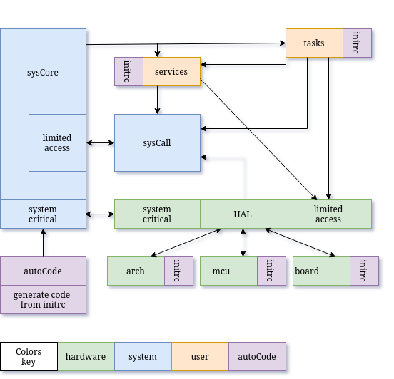

# TaskMate RTOS 
## Micro Controler Unit - Real Time Operating System

---

### ▶️ Introduction

**TaskMate** is a lightweight, preemptive real-time operating system.
Designed specifically for **microcontrollers**.
It emphasizes **reliability** and **modularity**.
Without relying on any external RTOS — everything is built entirely from scratch.

**TaskMate** is structured around a clean and portable architecture designed
to separate build logic, system logic, and hardware dependencies.

>  **Project Stats (v0.20)**
>
>  245 commits • 109 source files • 3491 lines of code •
> binary size : 6070 bytes (Flash) • ram usage : 2306 bytes

> ⚠️ **Development Status**
>
> TaskMate is currently in active development and
> should be considered **experimental**. While the core system and architecture are
> functional, many components are still evolving. It is **not yet suitable for production use**,
> and both APIs and internal structures may change without notice.

---

### 🧭 About ChatGPT and TaskMate

Although **no code from ChatGPT is ever copied directly** into the TaskMate source
tree, the project would never have reached its current level of maturity without
the assistance of AI. ChatGPT has been an invaluable tool for **structuring ideas,
learning new concepts, and refining both code and architectural design.** It
provides **technical guidance**. Moreover, it enables **efficient
research** on related topics by summarizing and contextualizing complex technical
information, helping me focus on building rather than endlessly searching.

See : [The Story of TaskMate and the AI Companion](doc/the_AI_companion.md)

---

### ⚙️ Build System

TaskMate uses a custom **Makefile** that fully manages dependencies and workflow.

- Automatic recompilation based on file changes, including headers and initrc.
- CLI commands like `make upload`, `make push` and `make backup`.
- architecture-specific and board-specific code is compiled without
using conditional macros (#ifdef).

**Portability is achieved by build selection, not by preprocessor logic.**

See : [Makefile & build system](doc/build_system.md)

---

### 🧱 HAL and Architecture Support

The HAL provide a **clean interface** between the system and the hardware.
Ensures true portability across hardware families.
This allow TaskMate to run on multiple architectures:

- **avr8** - the historical beginning of TaskMate
- **amd64** - for testing and faster development cycles
- **arm32v7-m4** - planned for future hardware performance upgrades

See : [Portability](doc/portability.md)

---

### ⏱️ Real-Time Behaviour

Although TaskMate includes preemptive scheduling and a software real-time clock,
it **is not yet a true real-time operating system** in the strict sense.

At its current stage, TaskMate guarantees **task switching** and **time slicing** with good stability,
but it does not yet ensure **hard real-time determinism.**

System latency and jitter are acceptable for testing and lightweight applications,
yet they remain **non-deterministic** under specific conditions such as nested interrupts,
driver contention, or prolonged critical sections.

See : [Future improvements](doc/RTOS_improvements.md)

---

### ⬆️ Layers

The new TaskMate layer configuration provides a **stronger isolation between system components**.
Each layer communicates through **well-defined interfaces**,
preventing direct access to the hardware or core system logic.

User tasks can still **benefit from all system features** —
such as messaging, timing, I/O, and services —
but always through indirect calls via the SysCall, SysServices and HAL layers.
This design significantly improves **stability** and **portability**.

---

### 🧩 Modular Design & autoCode

Starting with version 0.10, TaskMate uses a **modular design model**:

- Drivers, system services, and user tasks are placed in dedicated directories.
- Each directory provides a `*_init.rc` file describing initialization parameters.
- These files are parsed before **compile time** by a custom tool : `autoCode`.

The result is **auto-generated code**, without runtime overhead 👍

This approach keeps the flexibility of a dynamic system but ensures that
 **everything is resolved at compile time**, minimizing Flash and RAM usage.
This mechanism defines system initialization and resource mapping
**without manually hardcoding** any configuration.

See : [More about autoCode](doc/autoCode.md)
See : [Info about run level](doc/run_level.md)

---

### 🔜 Project progress ...

Upcoming features:

- HAL
- system-wide error handling
- Stack usage monitoring
- serial CLI command parser

See : [Road map](doc/check_list.md)

---

### ️📜 License

This software is distributed under the **TaskMate License v1.0**.

- Free for **non-commercial use** under conditions described in the `LICENSE` file.
- Commercial use requires a **separate paid license**.

To inquire about commercial licensing, please open an issue in this repository:
[Open Licensing Issue](https://codeberg.org/Doul09/TaskMate/issues).
By using this software, you agree to the terms of the TaskMate License v1.0.
See the `LICENSE` file for full details.

---

### 📟  Hardware setup : avr atmega2560 on Arduino mega board

---

### 📑 Documentation & books 📚

- **Compatibility** — versioning and guarantees: see [COMPATIBILITY.md](./COMPATIBILITY.md)
- **Changelog** — version history: see [CHANGELOG](./CHANGELOG)
- **C Style Guide** — best practices (pointers, errors, etc.): see [code best practices](./doc/code_best_practices.md)

- La référence du C norme ANSI-ISO, author Claude Delannoy, publisher Eyrolles. ISBN 2-212-09036-6
- Microcontleurs AVR : des ATtiny aux ATmega, author Christian Tavernier, publisher Dunod. ISBN 978-2-10-074417-6
- The markdown guide, author Matt Cone, publisher Amazon. ISBN 9798656504492
- Hands-On RTOS with Microcontrollers, author Brian Amos, publisher Packt. ISBN 978-1-83882-673-4
