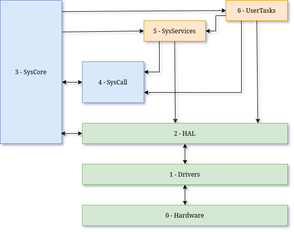

# TaskMate RTOS 
## MCU real time operating system

---

### ▶️ Introduction

**TaskMate** is a lightweight, preemptive real-time operating system.
Designed specifically for **microcontrollers**.
It emphasizes **reliability** and **modularity**.
Without relying on any external RTOS — everything is built entirely from scratch.

> **TaskMate Project Stats (v0.20)**
>
> 156 commits • 79 source files • 2309 lines of code •
> binary size : 3286 bytes (Flash) • ram usage : 1903 bytes

> **Main features that work (v0.20)**
> - Hybrid multithreading (cooperative & preemptive).
> - Real-time clock (RTC) support.
> - Modular drivers and thread registration.

---

### ⚙️ Build System

TaskMate uses a custom **Makefile** that fully manages dependencies and workflow.

- Automatic recompilation based on file changes, including headers.
- Colorized output for clarity.
- Separate source and build directories.
- CLI commands like `make upload`, `make push` and `make backup`.

See : [Makefile Features & Usage](doc/Makefile_summary.md)

---

### 🧱 HAL and Architecture Support

TaskMate is currently undergoing major development to improve portability.
A **Hardware Abstraction Layer (HAL)** is being implemented to isolate the system core from hardware-specific code.
This will allow TaskMate to run on multiple architectures:

- **AVR8 (ATmega)** – the historical beginning of TaskMate
- **AMD64** – for testing and faster development cycles
- **STM32** – planned for future hardware performance upgrades

---

### ⏱️ Real-Time Behaviour

Although TaskMate includes preemptive scheduling and a software real-time clock,
it **is not yet a true real-time operating system** in the strict sense.

At its current stage, TaskMate guarantees **task switching** and **time slicing** with good stability,
but it does not yet ensure **hard real-time determinism.**

System latency and jitter are acceptable for testing and lightweight applications,
yet they remain **non-deterministic** under specific conditions such as nested interrupts,
driver contention, or prolonged critical sections.

See : [Future improvements](doc/RTOS_improvements.md)

---

### ⬆️ Layers

See : [System Architecture and Isolation](doc/OS_architecture.md)

---

### 🧩 Modular Design & autoCode

Starting with version 0.10, TaskMate uses a **modular design model**:

- Drivers, system services, and user tasks are placed in dedicated directories.
- Each directory provides a `*_init.rc` file describing initialization parameters.
- These files are parsed before **compile time** by a custom tool : `autoCode`.

The result is **auto-generated code**, without runtime overhead 👍

This approach keeps the flexibility of a dynamic system but ensures that
 **everything is resolved at compile time**, minimizing Flash and RAM usage.

See : [More about autoCode](doc/autoCode.md)

---

### 🔀 Run Levels

The system implements run levels to control and sequence the initialization
of modules during system startup. Each module is assigned a run level according to its role:

- **RUN_NONE**: Not started automatically; can be manually launched later via the system CLI.
- **RUN_CORE**: Start only the minimal critical components required for the system to function safely.
- **RUN_DRIVER**: Initialize hardware drivers needed by higher-level services and tasks.
- **RUN_SERVICE**: Launch system services that depend on drivers but are still internal to the OS.
- **RUN_USER**: Start user tasks.

This mechanism is crucial for maintaining a deterministic and controlled startup sequence,
ensuring that dependencies are properly satisfied before launching higher-level components.
It also allows dynamic system management by enabling selective start/stop operations at runtime,
enhancing flexibility and robustness, especially for debugging, recovery, and partial system restarts.

---

### 🔜 Project progress ...

Upcoming features:

- HAL
- system-wide error handling
- Stack usage monitoring
- serial CLI command parser

* See : [Road map](doc/check_list.md)

---

### ️📜 License

This software is distributed under the **TaskMate License v1.0**.

- Free for **non-commercial use** under conditions described in the `LICENSE` file.
- Commercial use requires a **separate paid license**.

To inquire about commercial licensing, please open an issue in this repository:
[Open Licensing Issue](https://codeberg.org/Doul09/TaskMate/issues)

By using this software, you agree to the terms of the TaskMate License v1.0.

See the `LICENSE` file for full details.

> **Development Status**
>
> TaskMate is currently in active development and should be considered **experimental**.
> While the core system and architecture are functional, many components are still evolving.
> It is **not yet suitable for production use**, and both APIs and internal structures may change without notice.

---

### 📟  Hardware setup

---

### 📑 Documentation & books 📚

- **Compatibility** — versioning and guarantees: see [COMPATIBILITY.md](./COMPATIBILITY.md)
- **Changelog** — version history: see [CHANGELOG](./CHANGELOG)
- **C Style Guide** — best practices (pointers, errors, etc.): see [code best pratices](./doc/code_best_practices.md)

- La référence du C norme ANSI-ISO, author Claude Delannoy, publisher Eyrolles. ISBN 2-212-09036-6
- Microcontleurs AVR : des ATtiny aux ATmega, author Christian Tavernier, publisher Dunod. ISBN 978-2-10-074417-6
- The markdown guide, author Matt Cone, publisher Amazon. ISBN 9798656504492
- Hands-On RTOS with Microcontrollers, author Brian Amos, publisher Packt. ISBN 978-1-83882-673-4
