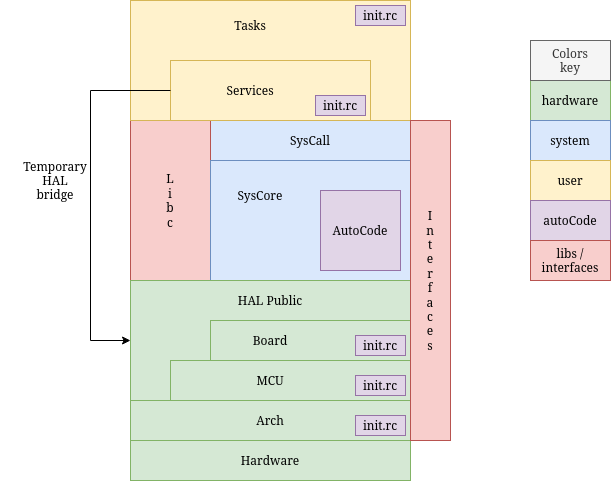
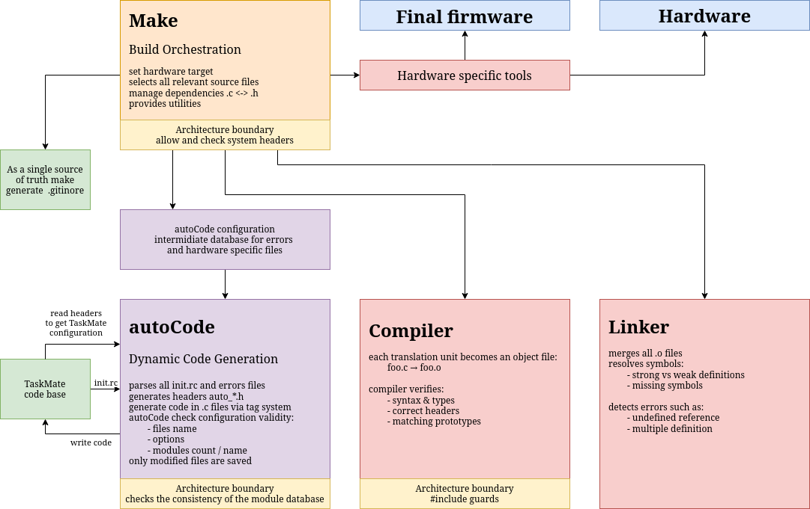
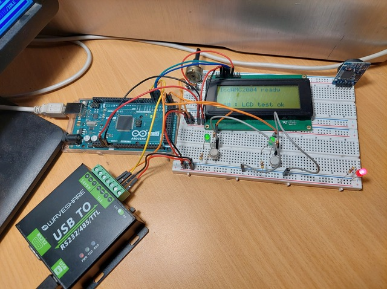

# TaskMate RTOS 

**Microcontroller Unit - Real-Time Operating System**

---

## ▶️ Introduction

**TaskMate is a personal project focused on learning C programming and real-time operating system
design through hands-on practice, experimentation, and iterative development.**

At a much smaller scale and within my own limits, this project is also a way to retrace—step by
step—the kind of questions and discoveries that shaped early systems like Unix, by exploring what
the fundamental primitives of an operating system should be and how they can be implemented from scratch.

TaskMate operating system is designed for microcontrollers; reliability and modularity are constraints
that guide design choice. Its architecture is structured to maintain a clear separation between build
logic, system behavior, and hardware dependencies, ensuring both portability and maintainability.

>  **Project Stats (v0.27 [^1] )**
>
>  442 commits • 119 source files • 6762 lines of code •
> binary size : 6496 bytes (Flash) • ram usage : 2009 bytes

> ⚠️ **Development Status**
>
> TaskMate is currently in active development and
> should be considered **experimental**. While the core system and architecture are
> functional, many components are still evolving. It is **not yet suitable for production use**,
> and both API and internal structures may change without notice.

---

## ⬆️ TaskMate Layers

The diagram shows the current layered architecture of TaskMate.
Each layer communicates primarily with its direct neighbors, following a strict top-down model to
maintain clear boundaries and avoid hidden dependencies.

Some components, such as interfaces and the lightweight libc, play a transversal role across multiple
layers. Rather than breaking the architecture, they provide controlled and well-defined access points
that help decouple the system while preserving its structure.

System features such as messaging, timing, I/O, and services remain fully accessible to user
tasks—but always through controlled and indirect interactions.

---

## ⚙️ Build System

TaskMate uses a custom **Build system** that fully manages dependencies and workflow.

- Automatic recompilation based on file changes, including headers and configuration files.
- CLI commands like `make upload`, `make push` and `make backup`.

**Portability relies mostly on build-time source selection, with minimal use of preprocessor logic.**

---

## ⏱️ Real-Time Behaviour

Although TaskMate includes preemptive scheduling and a software real-time clock,
it **is not yet a true real-time operating system** in the strict sense.

At its current stage, TaskMate guarantees **task switching** and **time slicing** with good stability,
but it does not yet ensure **hard real-time determinism.**

System latency and jitter are acceptable for testing and lightweight applications,
yet they remain **non-deterministic** under specific conditions such as nested interrupts,
driver contention, or prolonged critical sections.

---

## 🧩 Key Concepts

> A few core ideas shape the design of TaskMate and guide its evolution:

**HAL (Hardware Abstraction Layer)**

The HAL isolates all hardware-specific details behind a consistent interface.
It allows the system to remain portable and predictable, regardless of the underlying architecture, MCU, or board.

**SysCall (System Call Layer)**

The system call layer acts as a controlled boundary between user space and the system core.
It ensures that all interactions with the kernel are explicit, validated, and well-defined.

**Interfaces**

Interfaces provide neutral contracts between layers.
They help reduce coupling by defining shared types and behaviors without exposing implementation details,
making the system easier to evolve and refactor.

**AutoCode**

AutoCode is used to generate parts of the system from simple configuration files.
It helps maintain consistency, reduce boilerplate, and keep the overall structure aligned with the intended architecture.
All generation happens at compile time, with static allocation, ensuring zero runtime overhead and fully deterministic behavior.

See : [Portability](doc/rules/portability.md)
See : [More about autoCode](doc/rules/autoCode.md)

---

## 🧭 About ChatGPT and TaskMate

Although **no code from ChatGPT is ever copied directly** into the TaskMate source
tree, the project would never have reached its current level of maturity without
the assistance of AI. ChatGPT has been a great tool for structuring ideas,
learning new concepts, and refining both code and architectural design. It
provides technical guidance. Moreover, it enables efficient
research on related topics by summarizing and contextualizing complex technical
information, helping me focus on building rather than endlessly searching.

See : [The Story of TaskMate and the AI Companion](doc/the_AI_companion.md)

---

## ️📜 License

This software is distributed under the **BSD-2-Clause License**.

You may use, modify, and redistribute it in source or binary form,
provided that you keep the copyright notice, license conditions,
and disclaimer as described in the `LICENSE` file.

---

## 📟  Hardware setup : avr8 - atmega2560 - Arduino mega board

---

## 📑 Documentation & books 📚

- **Project development status** — see [Project Progress](doc/progress.md)
- **Changelog** — version history: see [CHANGELOG](./CHANGELOG)
- **C Style Guide** — best practices (pointers, errors, etc.): see [code best practices](./doc/C_code_best_practices.md)

**Architecture :**

You will find more information about the architecture in the doc/architecture/files.
These files contain information about the development history, current implementation,
strengths and weaknesses of source code, and future improvements.

**Books :**

- La référence du C norme ANSI-ISO, author Claude Delannoy, publisher Eyrolles. ISBN 2-212-09036-6
- Microcontrôleurs AVR : des ATtiny aux ATmega, author Christian Tavernier, publisher Dunod. ISBN 978-2-10-074417-6
- The markdown guide, author Matt Cone, publisher Amazon. ISBN 9798656504492
- Hands-On RTOS with Microcontrollers, author Brian Amos, publisher Packt. ISBN 978-1-83882-673-4
- Making Embedded Systems, author Elecia White, publisher O'Reilly. ISBN 978-1-098-15154-6
- Operating System Design, The Xinu Approach, third edition, author Douglas Comer, publisher CRC Press, ISBN 978-1-032-98099-7
- The design and implementation of the FreeBSD operating system, second edition, authors Marshall Kirk McKusick, George V. Neville-Niel and Robert N.M. Watson, publisher Addison-Wesley, ISBN 978-0-312-96897-2

[^1]: ⚠️ Warning : Versions 1.37, 2.71, 3.14 and 4.2 are intentionally skipped. Universe backward compatibility constraints apply.
