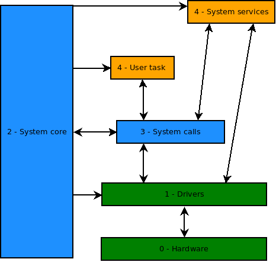

# TaskMate RTOS
## AVR preemptive real time oprating system

> **TaskMate Project Stats (v0.11)**
>
> 116 commits • 58 source files • 3854 lines of code •
> binary size: 2836 bytes (Flash)

### ▶️ Introduction

**TaskMate** is a lightweight, preemptive real-time operating system.
Designed specifically for **AVR mega microcontrollers**.
It emphasizes **reliability** and **modularity**.
Without relying on any external RTOS — everything is built entirely from scratch.

---

### ⚙️ Build System

TaskMate uses a custom **Makefile** that fully manages dependencies and workflow.

- Automatic recompilation based on file changes, including headers.
- Colorized output for clarity.
- Separate source and build directories.
- CLI commands like `make upload`, `make push`, and `make backup`.

* See : [Makefile Features & Usage](doc/Makefile_summary.md)

---

### ♻️ RTC Real Time Clock

Each thread have one 16 bits software time counter sycronized with other threads.

If not zero, the counter is decremented automatically at 10 ms rate, it can be used for sleep/delay behaviors.

---

### ✔️ Features

* Hybrid multithreading (cooperative & preemptive).
* Dynamic driver and thread  management.
* Real-time clock (RTC) support.
* Modular drivers and thread registration.

---

### ⤴️ Layers



---

### ⚙ Modular Design & autoCode

Starting with version 0.10, TaskMate uses a **modular design model**:

- Drivers, system services, and user tasks are placed in dedicated directories.
- Each directory provides a `*_init.rc` file describing initialization parameters.
- These files are parsed before **compile time** by a custom tool : `autoCode`.

The result is **auto-generated code**, without runtime overhead:

| File | Purpose |
|------|---------|
| `sysCore/autoInclude.h` | Centralized modules includes |
| `sysCore/autoAlloc.h`   | Modules allocation tables |
| `sysCore/initSys.c` | Modules initialization code |

All modules are referenced through the global structure `modules`:

```c
modules.threads[i].name
modules.drivers[i].id
```

This approach keeps the flexibility of a dynamic system but ensures that
 **everything is resolved at compile time**, minimizing Flash and RAM usage.

---

### ⎇ Run Levels

The system implements run levels to control and sequence the initialization
of modules during system startup. Each module is assigned a run level according to its role:

- **RUN_NONE**: Not started automatically; can be manually launched later via the system CLI.
- **RUN_CORE**: Start only the minimal critical components required for the system to function safely.
- **RUN_DRIVER**: Initialize hardware drivers needed by higher-level services and tasks.
- **RUN_SERVICE**: Launch system services that depend on drivers but are still internal to the OS.
- **RUN_USER**: Start user tasks.

To save memory, the run level is stored using only the three least significant bits
of the module's status byte (RUN_LEVEL_MASK = 0xF8).

This mechanism is crucial for maintaining a deterministic and controlled startup sequence,
ensuring that dependencies are properly satisfied before launching higher-level components.
It also allows dynamic system management by enabling selective start/stop operations at runtime,
enhancing flexibility and robustness, especially for debugging, recovery, and partial system restarts.

---

### ➡️ Project progress ...

Coming features:
- Mutex and semaphore support
- Inter-thread message passing
- Stack usage monitoring
- CLI command parser with argument handling

* See : [Road map](doc/check_list.md)

---

### ️⚠ ️License

This software is distributed under the **TaskMate License v1.0**.

* Free for **non-commercial use** under conditions described in the `LICENSE` file.
* Commercial use requires a **separate paid license**.

To inquire about commercial licensing, please open an issue in this repository:
[Open Licensing Issue](https://codeberg.org/Doul09/TaskMate/issues)

By using this software, you agree to the terms of the TaskMate License v1.0.

See the `LICENSE` file for full details.

