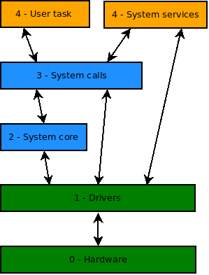

# TaskMate RTOS
## AVR preemptive real time oprating system
 
### Introduction

**TaskMate** is a lightweight RTOS for AVR microcontrollers with a focus on reliability, real-time, and modularity.

Each task have it's own stack, used to save and restore context for task switching

### Installation

* See : [Makefile Features & Usage](Makefile_summary.md)

### RTC Real Time Clock

Each task have one 16 bits timer/counter sycronized wtih other tasks.

If not zero the counter is decremented at 10 ms rate.
 

### Features

* Hybrid multitasking (cooperative & preemptive)
* Dynamic driver & task  management
* Real-time clock (RTC) support
* Serial command-line interface (CLI)
 
  
### Layers
 

### Project progress ...

* See : [Road map](check_list.md)

### License

This software is distributed under the **TaskMate License v1.0**.

* Free for **non-commercial use** under conditions described in the `LICENSE` file.
* Commercial use requires a **separate paid license**.

To inquire about commercial licensing, please open an issue in this repository:  
[Open Licensing Issue](https://codeberg.org/Doul09/TaskMate/issues)

By using this software, you agree to the terms of the TaskMate License v1.0.

See the `LICENSE` file for full details.

